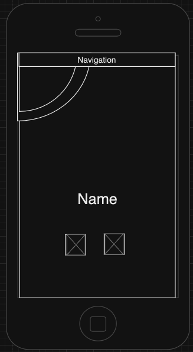
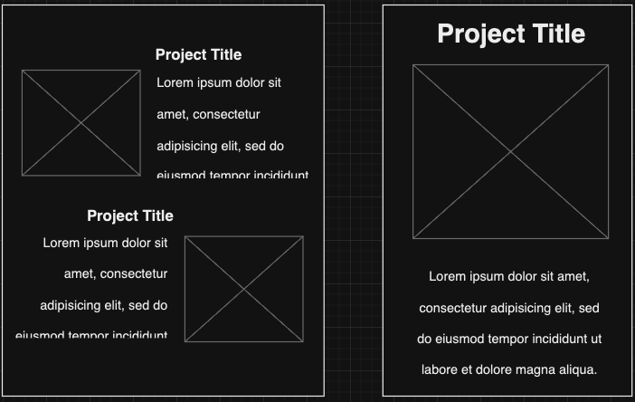
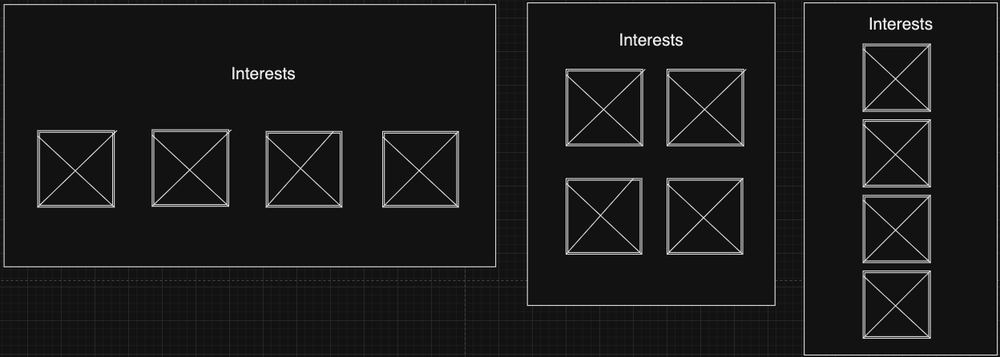
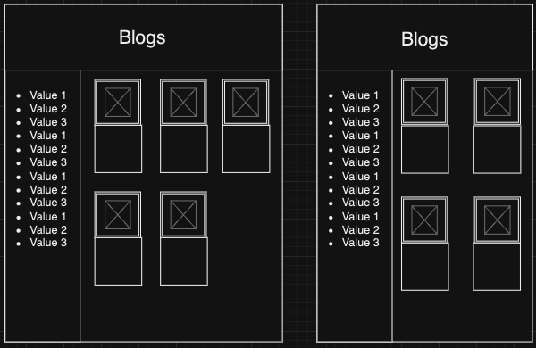
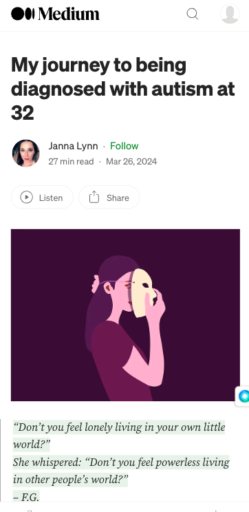
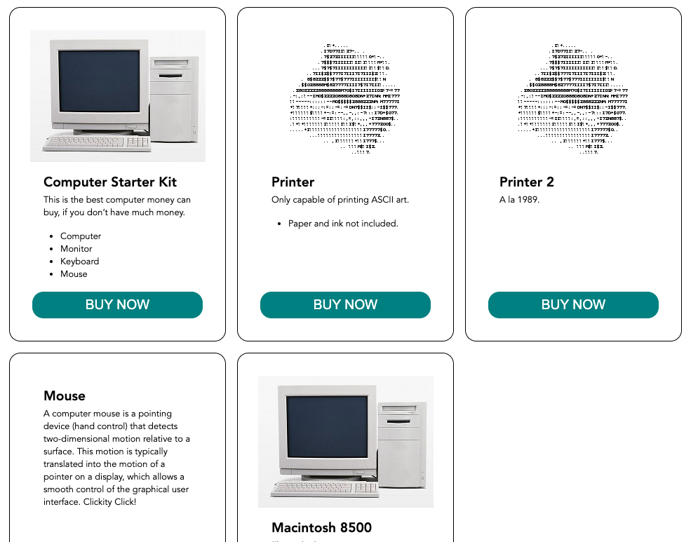

# Portfolio project documentation

## Portfolio GitHub repository: https://github.com/Kasun1Don/portfolio

## <ins>Portfolio Description</ins>

The purpose of this project is to communicate my abilities and coding experience, as well as my personality and interests to prospective employers.

### Target Audience

The target audience are potential employers with a technical background in software development. 

### Technology stack used for this project:

* HTML
* CSS
* Git version control

## Mood Board

Firstly, to get a clear idea of what I wanted the portfolio to feel and look like overall I resorted to a moodboard for brainstorming. This allowed me to set the overall vibe the website presented as I continue developing it.

 &nbsp;  

I wanted the aesthetic to be similar to the websites my target audience would spend a lot of time on like GitHub or API documentation sites like Stripe. I know many techinical people at software companies, including myself, prefer dark mode similar to GitHub's default theme. Therefore I decided to go with a dark theme with a great contrasting primary color.

## Color Scheme

* Primary: #FF8833 (orange)
* Secondary: #FF6A00 (neon orange)
* Background: #000000 (black)
* Secondary-Background: #1c1e26 (dark grey)
* Accent: #F5F5F5 (off-white)

The primary color orange constrasts great against the black background and enhances the visibility of the website. In color theory, orange evokes enthusiasm, which is desirable when the target audience is viewing the portfolio. I personally love that orange is associated with innovative thinking.  

## Sitemap of all pages

 &nbsp;

The overall website structure will be as follows:
 
The main landing page (index.html) will be the homepage where all the details about me, my work/ study history, my professional links and my past projects will be showcased. This helps the user access all the portfolio information seamlessly without page transitions, reducing friction.

The main navigation on the home page will link to a child "blogs" html page which is the list of links all the blogs I post. This page will present a growing catalogue of blog posts as I continure to post blogs into the future.

## Wireframes

After completing the mood board I put down my initial idea for the layout of the website by drawing a brief wireframe sketch on paper (as per below). 

I decided to design and develop the website mobile first so the focused was on having a detailed mobile viewport wireframe and then expanding out into larger viewport wireframes.

 &nbsp;

The final wireframes were completed using the Diagrams.net tool.

The website was built to be responsive starting from a mobile viewport size of 414px (iPhone XR). Tablet and Desktop wireframes were drawn when there were signigicant changes to the layout of the website compared to the mobile viewport size i.e. where a media query may be used.

### Aesthetics decision making process

Some of the designs and components from the hand drawn wireframes were changed/omitted when creating the final wireframes.

 &nbsp;

*iphone wireframe
*inspired by the rainbow circles Ed Challenge CSS Layout Challenge and CSS Animations.

 &nbsp;

 &nbsp;
* Tablet wireframe

 &nbsp;

 &nbsp;

 &nbsp;

 &nbsp;

 &nbsp;
* Desktop wireframe

 &nbsp;

 &nbsp;

 &nbsp;
*inspired by the medium blog layout
 &nbsp;

### Components and styling decisions 

 &nbsp;

Jen Simmons 
https://labs.jensimmons.com/2017/03-009.html
&nbsp;