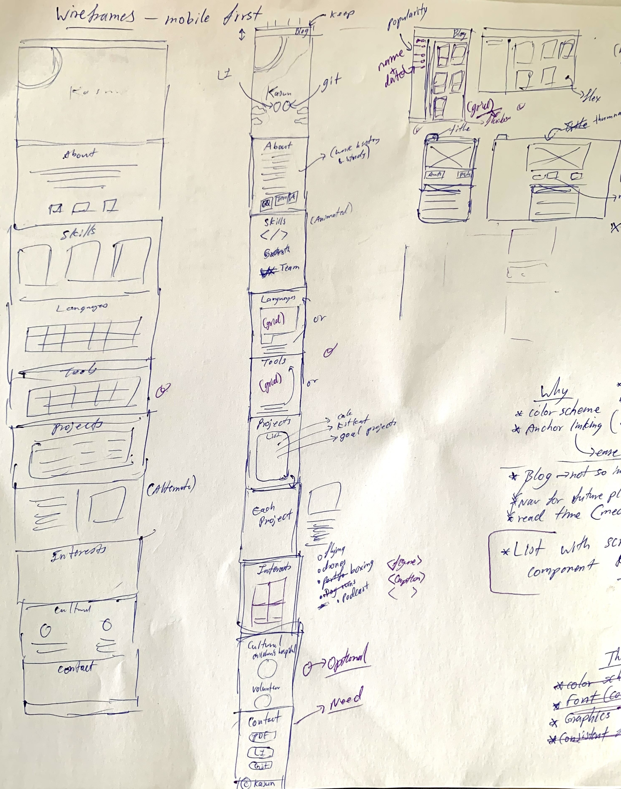

# Portfolio project documentation

## Portfolio GitHub repository: https://github.com/Kasun1Don/portfolio

## <ins>Portfolio Description</ins>

The purpose of this project is to communicate my abilities and coding experience, as well as my personality and interests to prospective employers.

### Target Audience

The target audience are potential employers with a technical background in software development. 

### Technology stack used for this project:

* HTML
* CSS
* Git version control

## Mood Board

Firstly, to get a clear idea of what I wanted the portfolio to feel and look like overall I resorted to a moodboard for brainstorming. This allowed me to set the overall vibe the website presented as I continue developing it.

 &nbsp;  

I wanted the aesthetic to be similar to the websites my target audience would spend a lot of time on like GitHub or API documentation sites like Stripe. I know many techinical people at software companies, including myself, prefer dark mode similar to GitHub's default theme. Therefore I decided to go with a dark background theme with a great contrasting primary color.

## Color Scheme

* Primary: #FF8833 (orange)
* Secondary: #FF6A00 (neon orange)
* Background: #000000 (black)
* Secondary-Background: #1c1e26 (dark grey)
* Accent: #F5F5F5 (off-white)

The primary color orange constrasts great against the black background and enhances the visibility of the website. In color theory, orange evokes enthusiasm, which is desirable when the target audience is viewing the portfolio. I personally love that orange is associated with innovative thinking.  

## Sitemap of all pages

 &nbsp;

The overall website structure will be as follows:
 
The main landing page (index.html) will be the homepage where all the details about me, my work/ study history, my professional links and my past projects will be showcased. This helps the user access all the portfolio information seamlessly without page transitions, reducing friction.

The main navigation on the home page will link to a child "blogs" html page which is the list of links all the blogs I post. This page will present a growing catalogue of blog posts as I continure to post blogs into the future.

## Wireframes

After completing the mood board I put down my initial idea for the layout of the website by drawing a brief wireframe sketch on paper (as per below). 

I decided to design and develop the website mobile first so the focused was on having a detailed mobile viewport wireframe and then expanding out into larger viewport wireframes.

 &nbsp;

The final wireframes were completed using the Diagrams.net tool.

The website was built to be responsive starting from a mobile viewport size of 414px (iPhone XR). Tablet (755px) and Desktop (1000px) wireframes were drawn when there were signigicant changes to the layout of the website compared to the mobile viewport size i.e. where a media query may be used.

### Aesthetics decision making process

Some of the designs and components from the hand drawn wireframes were changed/omitted when creating the final wireframes.

Below is the wireframe for the mobile viewport size of 414px. This was determined by my personal phone size. 

 &nbsp;

I decided to place a bright eye-catching animatined eliment on the top left of corner of the home screen (header) to bring through my original mood for the website encapsulated on my mood board with the neon orange sunset on the black background. I believe this shows personality and makes my portfolio stand out from the initial impression.

A navigation bar will be floating at the top of the viewport on all pages to allow the user to quickly navigate between pages.

I wanted to have a visual representation of my main professional links, GitHub and LinkedIn, right below my name if the user didn't want to scroll or navigate all the way to the contacts at the bottom of the page. This layout is optimised for mobile and will scale well for tablet and desktop devices.

 &nbsp;

The about section is quite simple, I wanted the highlight to be on the paragraph text in the middle of the page heirarchy and have a visual representation of the organisations I mention. This simple layout will scale well for tablet and desktop devices.

 &nbsp;

Significant changes were made to the Skills mobile section to enhance the experience on a tablet viewport. Therefore, both are shown above.

The skills section should show my three main skills for potential employers and with a visually applealing representation of each before adding more context with text below. On a mobile viewport the visual appeal will be inviting for the user to keep scrolling down. 

However, the single column layout isn't optimal for a larger tablet layout because the user has enough space to see all three main skills at once. This wide layout will work well for a larger desktop viewport too.

 &nbsp;

 &nbsp;

I wanted to have a quick visual representation of all the programming languages I will know and the tools I will be able to use as a developer. This needed to be expandable as I keep growing in my career so I decided to go for a grid layout. 

The grid layout should be adapted horizontally in larger viewports like tablets to reduce scrolling and take advantage of the viewport width. It will scale well for desktops too.

I had originially planned to have a text explanation under the visuals as seen in my sketches, however I realised that my target audience would be very familiar with the visual representations of common languages and tools.

 &nbsp;

The projects navigation was designed to allow the user to easily skip to the project they were interested in discovering more about rather than having to scroll down through each project. This is useful because the list of projects will continue to grow as I progress in my career.

The navigation is easily adapted to a larger viewport by stretching out he element in the center and presenting the project links in columns. Increasing the number of columns relative to the viewport width.

 &nbsp;

Each project will be layed out in its own section with the title, a screenshot preview of the project and a paragraph description. This allows the user to scroll between each distictive project. 

I decided to use adaptive design methodology to make it a better user experience on larger viewports like tablets and desktops by laying out the project horizontally next to the description and title. Ideally this horizontal layout switches for each project as shown above, which I have seen executed aesthetically on many other websites.

 &nbsp;

Significant changes were made to the Interests mobile section to enhance the experience on a tablet viewport and then for a desktop viewport. Hence, all viewports are shown above.

The interests section is quite simple with visual representations of my interests. Since there isn't much text I wanted to makesure the details in the images are visible through sizing. Showing more images in a lower view height, the user doesn't have the friction of scrolling as much. Thus, I decided to make the images gallery wider as screen width grows, naturally reducing the view height of the section. 

 &nbsp;

I decided the contact section should have calls to action using buttons and the button heirarchy should be from least to most important professional link. This section is optimized for mobile and will scale well for tablet and desktop devices as the buttons grow in size.

The footer will bea very thin section at the bottom of the website and consistent across all pages because it doesn't add much value to a portfolio website.

 &nbsp;

Blogs will be navigated through a column to the left with a list of all blog posts ordered by popularity and date published next to them. This would be beneficial context to the user as the list of blogs published grows in future. 

In addition, I decided to include a visual representation of the blog posts in a cards format, to the right, with a thumbnail view of each blog post header photo. This draws the users attention visually rather than looking at just a bland list. 

This section is optimized for mobile and will scale well for tablet and desktop devices by simply showing more cards as shown above.

 &nbsp;

For the individual blog posts' content arrangement, I was inspired by Medium, the blogging platform. I wanted the author, date published and estimated read time to show at the top of the article like in Medium. An example medium blog post is included below. However, I wanted to have the header photo above the heading of the blog because I believe the user would already know the blog title if they are in the blog view.

Similar to Medium, I decided the blog width should only grow to a view width similar to a tablet view width (755px) because this makes the blog more aesthetically plasing to view/read. This is demonstrated when comparing the tablet and desktop wireframe above.

 &nbsp;

## Components and styling decisions 

 &nbsp;

I decided to add jump links using # in the anchor links to jump between the diffent section of my portfolio on the home page rather than scrolling. I decided the scrolling behavior was too abrupt so I changed the scrolling behavior to "smooth" which is much more pleasing. 

 &nbsp;

*inspired by the rainbow circles Ed Challenge CSS Layout Challenge and CSS Animations.

 &nbsp;

 &nbsp;

 &nbsp;

 &nbsp;

 &nbsp;

 &nbsp;

 &nbsp;

 &nbsp;

 &nbsp;

*can easily navigate back to home or blogs page

Jen Simmons 
https://labs.jensimmons.com/2017/03-009.html
&nbsp;

 &nbsp;

*can easily navigate back to home or blogs page

